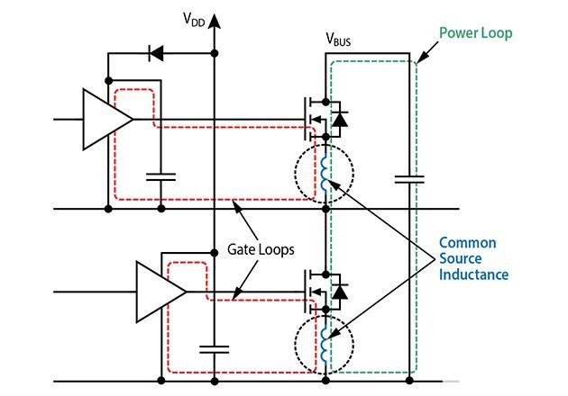
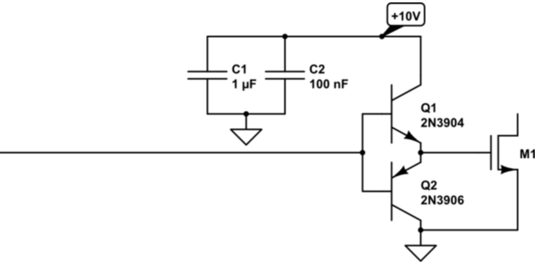
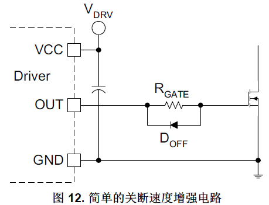

## 一.前言

当我们使用MOS管进行一些PWM输出控制时，由于此时 [开关](https://www.hqchip.com/app/848) 频率比较高，此时就要求我们能更快速的开关MOS管，从理论上说， [MOSFET](https://www.elecfans.com/tags/mosfet/) 的关断速度只取决于栅极驱动 [电路](https://bbs.elecfans.com/zhuti_dianlu_1.html) 。当然 [电流](https://www.elecfans.com/tags/%E7%94%B5%E6%B5%81/) 更高的关断电路可以更快对输入 [电容器](https://www.elecfans.com/tags/%E7%94%B5%E5%AE%B9%E5%99%A8/) 放电，从而缩短开关时间，进而降低开关损耗。如果使用普通的 N沟道器件，通过更低输出 [阻抗](https://www.hqpcb.com/) 的 MOSFET驱动器和/或负关断电压，可以增大放电电流。提高开关速度也能降低开关损耗，当然由于 MOSFET的快速关断也会造成 di/dt和 dv/dt更高，因此关断加速电路会在波形中增加振铃的发生。
## 二.方案说明
下图是一个典型的MOS管驱动电路构成原理图，我们先简单分析一下各个 [元器件](https://www.hqchip.com/nav.html) 。 [电容](https://www.elecfans.com/yuanqijian/dianrongqi/) $Cg$是MOS管自身的米勒寄生电容，MOS管的开关快慢它是一个重要影响因素，由于所以我们可以从器件 [选型](https://www.hqchip.com/app/canshu) 上选择$Cg$较小的MOS管；$Lg$和$Rg$跟驱动电路还有MOS以及 [PCB布线](https://dfm.elecfans.com/viewer/?from=neilian) 有关，为了实现快速开关MOS，我们需要把这几个参数都降到最低才行，接下来就分别说说对应的具体设计。
### 1.降低栅极电阻$Rg$以及寄生电感$Lg$
$Rg$的存在主要是为了降低$MOS$开关时振铃的发生，上篇文章我们介绍过了如果计算选型$Rg$来降低开关时的振铃，所以首先外部串联的$Rg$要在满足基于减弱开关振铃的要求的基础上尽可能的小，其次 [PCB走线](https://dfm.elecfans.com/viewer/?from=neilian) 不能太细，当然驱动器和MOS距离要尽可能近，减小电流回路， [PCB](https://www.hqpcb.com/) 走线以及器件布局对于降低$Lg$来说很重要，大家一定要重视。

### 2.提高驱动电流能力
直接用 [单片机](https://bbs.elecfans.com/zhuti_mcu_1.html) IO口驱动来实现MOS管快速开关那可太困难了，毕竟单片机IO口驱动能力实在有限啊。选用两个 [三极管](https://www.elecfans.com/dianyuan/633947_3.html) 搭建推挽输出驱动电路是个不错的成本不算高的选择。

### 3.增加快速关断二极管
在此电路中，RGATE允许调整 MOSFET开通速度。在关断过程中，反向并联二极管会对电阻器进行分流。但是二极管存在着导通电压的问题，随着栅源极电压接近 $0V$，二极管的作用越来越小。所以，此电路能显著减少关断延迟时间，对于整体开关时间和 $dv/dt$抗扰性帮助有限，所以我们进行二极管选型时要选择导通压降小的二极管，比如肖特基二极管。

### 4、PNP三极管关断

