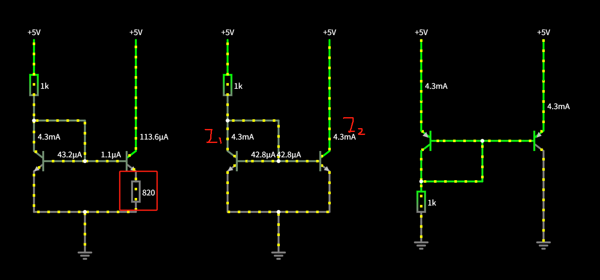
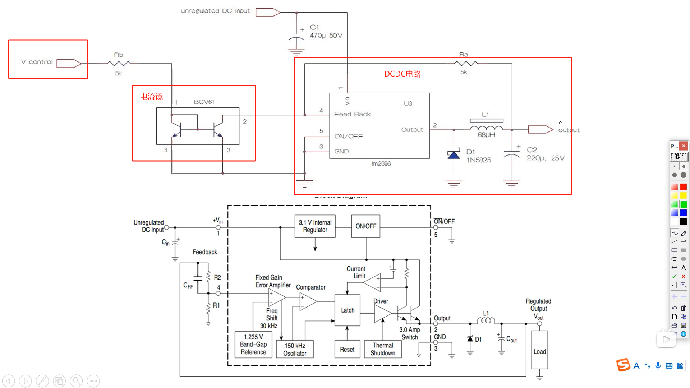
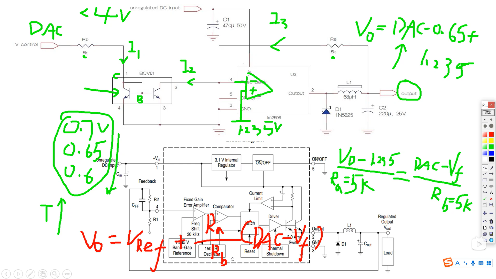

### 一、电流镜原理
[电流镜与差分放大器-CSDN博客](https://blog.csdn.net/weixin_44123999/article/details/102632282)

将电流进行复制，同时还可以调节复制电路的输出端的电阻数值，用于调节电流偏置。

[电流镜电路.txt](https://www.yuque.com/attachments/yuque/0/2025/txt/43593038/1748093880963-fe14c913-e03b-4718-8c46-ef24a7e9e9a2.txt)

### 二、电流镜控制做数字电压源

电流镜DCDC控制芯片可以用LM5116，LM5117

