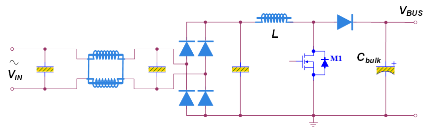
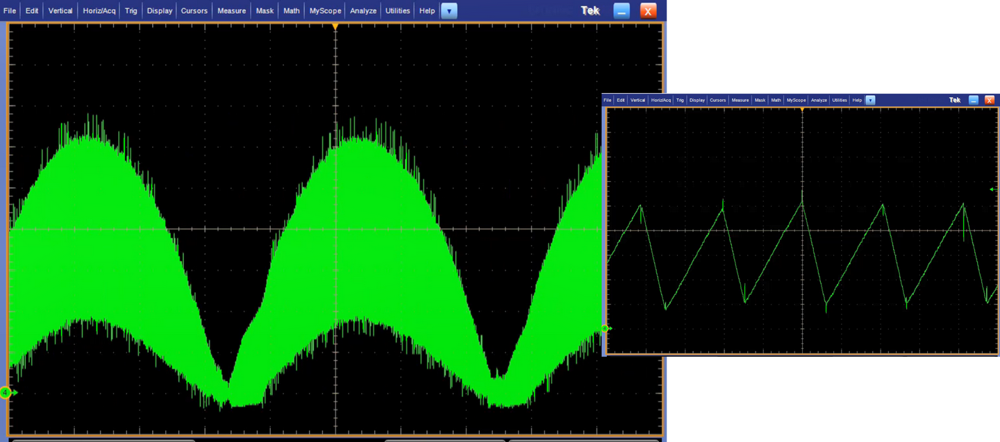
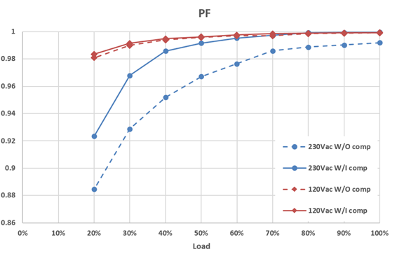
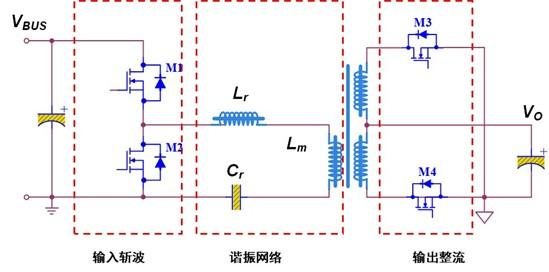
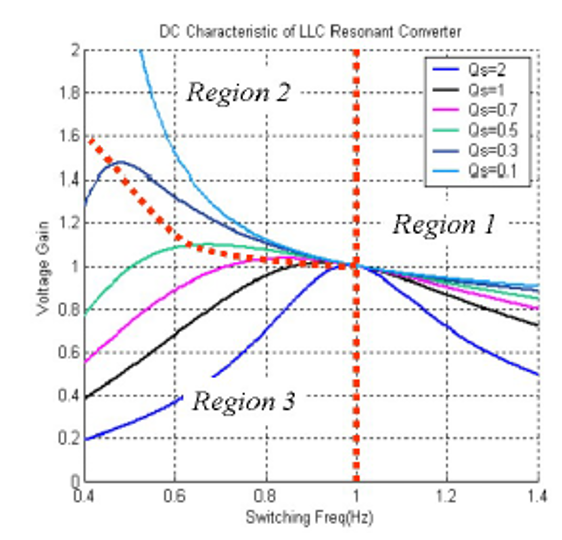
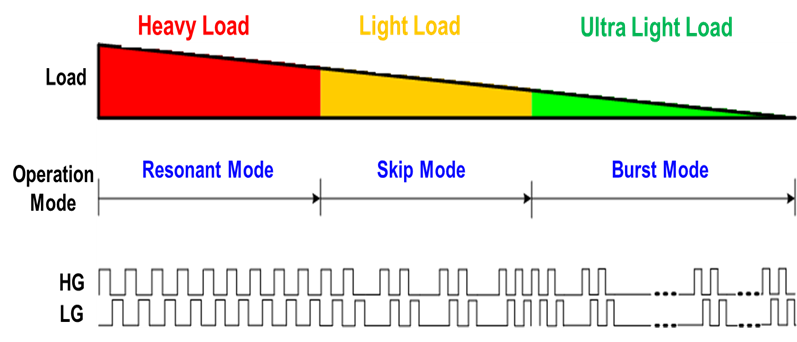
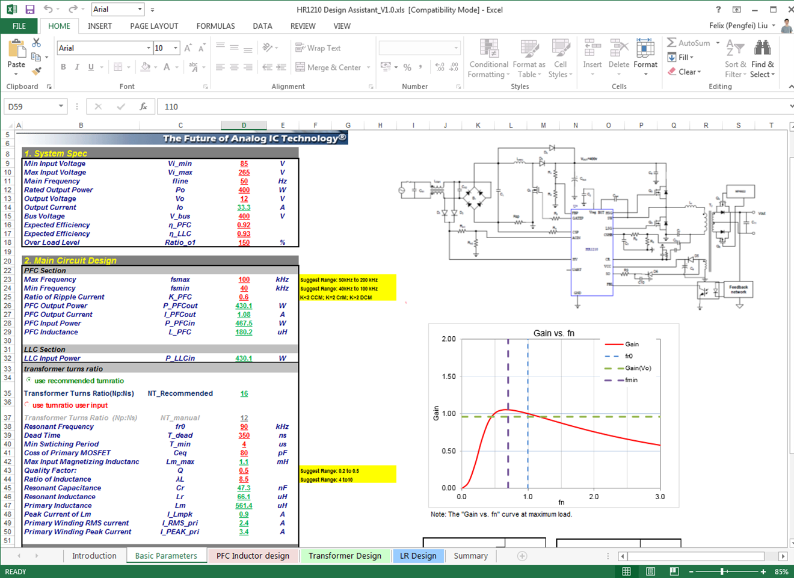

[零基础掌握先进的PFC+LLC解决方案](https://www.zhihu.com/tardis/bd/art/8370202774)
[【技术文章】零基础掌握先进的PFC+LLC解决方案（PFC篇）](https://forum.monolithicpower.cn/t/topic/4929)
[零基础掌握先进的PFC+LLC解决方案（LLC篇）](https://www.ednchina.com/technews/28734.html)

## **一、PFC 篇**
在电能质量和用电效率越来越重要的背景下，采用 **PFC+LLC** 架构的电源设计越来越普及，并已经开始在很多应用中替代传统的无 PFC 的方案或简单的反激、正激方案。今天我们从基础说起，让各位从入门到精通掌握 **PFC+LLC 的先进解决方案**。

[https://xg.zhihu.com/plugin/9a33b7d908c5528bff0100225a7c8980?BIZ=ECOMMERCE](https://xg.zhihu.com/plugin/9a33b7d908c5528bff0100225a7c8980?BIZ=ECOMMERCE)

### 首先，为什么要用 PFC？
一个没有 PFC 的电源在 AC 输入端的波形通常是长这样的：

一想到这么多尖尖电流在我们的电网里流通，是不是有种如坐针毡的感觉？PFC 就是用来解决这个问题的。虽然听起来就很贵的样子，但是 PFC 可以把 AC 输入端的波形变成这样，不止可以保护电网质量，还能治好工程师的强迫症（手动狗头）。

PFC 可以有很多种不同实现方式，但大部分实用电路都是在 Boost 或在 Boost 基础上的衍生变形。

**而从控制方式的角度来说，PFC 主要可以分为 CCM 和 CrM 两类。**

CCM 控制是指 Boost 电路中的电感电流处于连续导通状态，这样的好处可以用峰值比较低的电感电流实现比较大的输出功率，但同时所带来的问题是二极管反向恢复引入的开关损耗；CrM 控制是指 Boost 电路中的电感电流处于临界导通状态，这种状态下二极管电流是自然过零关断的，所以没有反向恢复问题，但在实现同等输出功率的情况下，CrM 的电感电流峰值必然大于 CCM，这不利于电感设计。

**基于上述特点，CCM 适合更大功率，而 CrM 适合较小的功率。二者的合理分界线通常在 300W-400W 之间。**

### MPS 提供一系列的先进的 PFC+LLC 集合数字控制芯片
**HR1211** 的 PFC 部分采用 CCM 控制方式，电感电流在重载情况下处于连续状态，并且开关频率可以通过数字接口进行配置。在轻载状态下 HR1211 会自动降低开关频率，并过渡到断续电流状态，以此降低开关损耗，从而达到全范围工作状态下的高效率。

[https://xg.zhihu.com/plugin/9da1cc990eb1923fa2e8dfc0075c79dd?BIZ=ECOMMERCE](https://xg.zhihu.com/plugin/9da1cc990eb1923fa2e8dfc0075c79dd?BIZ=ECOMMERCE)

**HR1275** 的 PFC 部分采用 CrM 控制方式，电感电流在重载情况下处于临界导通状态，并同样在在轻载状态下会自动降低开关频率，过渡到断续电流状态。而且无论是临界导通还是断续状态，HR1275 都会通过内部的检测电路保证谷底开通，从而将开关损耗降到最低。

[https://xg.zhihu.com/plugin/b188fc5566686bb9e3198b657dd51069?BIZ=ECOMMERCE](https://xg.zhihu.com/plugin/b188fc5566686bb9e3198b657dd51069?BIZ=ECOMMERCE)

以此降低开关损耗，从而达到全范围工作状态下的高效率。

另外，**HR1211** 和 **HR1275** 都提供了 PF（或THD）补偿的功能，自适应地消除电路中的非理想因素对输入电流波形的影响，可以在各种输入电压和负载条件下实现0.9以上的PF值。特别在高压输入的情况下，相较于没有此功能的 PFC 方案有明显优势。可谓是无死角的“真•PFC”方案。

## **二、LLC 篇**
全面了解了 PFC 的情况之后， 让我们来介绍它的好朋友 LLC。而为什么把 **PFC 和 LLC** 称为好朋友呢？这要从 LLC 的特点和 PFC 的一个隐藏技能这两个方面慢慢道来。

### LLC 是通过谐振电感 Lr、励磁电感 Lm、谐振电容 Cr 谐振来进行功率变换的一种高效拓扑结构。
因为能以这种非常简单的结构完成全部开关管的 ZVS（零电压开通），从而实现**超高的转换效率和极低的电磁噪声**，LLC 是一种非常受欢迎的拓扑。

**以基波分析法为基础，可以计算得到 LLC 的主要特性。**

如下图所示，LLC 输入到输出的增益与开关频率有直接的关系，因此 LLC 控制也通常是通过反馈调节开关频率来实现的。

**当开关频率等于谐振频率的时候，**LLC 输入到输出的增益为 1，电路工作在完全谐振状态，实现软开关和高效的变压器利用率。

**在开关频率高于谐振频率的“Region 1”，**增益随开关频率升高而下降，因此 LLC 的开关频率是随负载下降而降低的。

但是需要特别指出的是，在 Q 值比较小（负载比较轻）的时候，增益随频率的幅度是非常有限的，因此 LLC 也很难支持输出电压下降的轻载工作状态。

**在开关频率低于谐振频率的“Region 2”，**增益随开关频率升高而上升，因此 LLC 能够通过降低开关频率的方式提供一定的升压能力，但是也有非常大的局限性。

一方面，开关频率下降导致励磁电流增加，越高的升压能力就意味着越大比例的励磁电流，这会造成极大的效率损失。

另一方面，在 Q 值比较大（负载比较重）的情况下，LLC 会进入“Region 3”，也就是容性模式，导致更加严重的硬开关问题。

**因此，LLC 的优势突出而弱点也非常明显。**

一方面 LLC 在输入输出比例相对固定的情况下可以完美的实现软开关以及高效率。

另一方面 LLC 也很难支持输入电压或输出电压的宽范围变化。这样在市电输入范围是 85Vac-265Vac 的情况下，LLC 是很难发挥出它的优势的。

**这时 PFC 刚好可以帮上大忙。**

虽然 PFC 的主业是把 AC 输入电流整理好，但由于 PFC 电路通常是基于 Boost 结构的，它还能顺便把宽范围的输入电压提高到一个固定的值（通常是 400V 左右），这就刚好弥补了 LLC 的弱点。这就是为什么在很多场合下 PFC 和 LLC 是一对形影不离的好朋友。

### MPS 提供一系列的先进的 **PFC+LLC** 集合数字控制芯片，让这组 CP 好好在一起！
**HR1211** 集成 CCM PFC 和 LLC 控制、**HR1275** 集成 CrM PFC 和 LLC 控制。

两颗芯片的 LLC 控制部分均采用稳定性和响应速度更优的电流模式，并引入了可编程的 Skip、Burst 控制模式以实现全范围的高效率。

另外，全系列芯片还配备了先进的**设计工具**和可视化接口软件，能够辅助完成高效的 PFC+LLC 的方案设计。

[https://xg.zhihu.com/plugin/602148858650df3c97757d2f6919b349?BIZ=ECOMMERCE](https://xg.zhihu.com/plugin/602148858650df3c97757d2f6919b349?BIZ=ECOMMERCE)

吐血安利 **MPS 中文技术论坛**，经验丰富的 MPS 工程师和你一起激情讨论技术热点！还有免费样片申请！不定期放送方案资料大礼包！用过的人都说：好好薅！

[https://xg.zhihu.com/plugin/77269ca1062f14305d7208c7768d4933?BIZ=ECOMMERCE](https://xg.zhihu.com/plugin/77269ca1062f14305d7208c7768d4933?BIZ=ECOMMERCE)[https://xg.zhihu.com/plugin/fdda89ad80b59fc3b0123b1007665f80?BIZ=ECOMMERCE](https://xg.zhihu.com/plugin/fdda89ad80b59fc3b0123b1007665f80?BIZ=ECOMMERCE)
