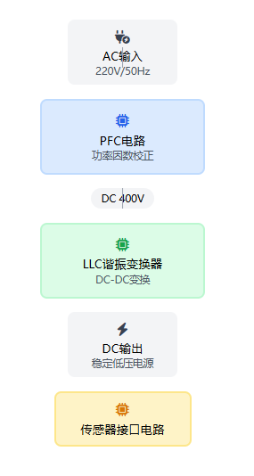

[PFC与LLC技术在传感器接口电路中的应用](https://so-landing.douyin.com/search_ai_mobile/share_canvas?_pia_=1&share_src=share_url&search_hash=6efc4b13991c6b612fd302950fba425e15445cda&aid=1128&scene=canvas&ai_title=%E8%AE%B2%E4%B8%80%E4%B8%AA%E5%92%8C%E4%BC%A0%E6%84%9F%E5%99%A8%E6%8E%A5%E5%8F%A3%E7%94%B5%E8%B7%AF%E7%9B%B8%E5%85%B3%E7%9A%84pfc+llc+%E9%A1%B9%E7%9B%AE&schema_type=66&utm_campaign=client_share&app=aweme&utm_medium=ios&tt_from=copy&utm_source=copy&query=%E8%AE%B2%E4%B8%80%E4%B8%AA%E5%92%8C%E4%BC%A0%E6%84%9F%E5%99%A8%E6%8E%A5%E5%8F%A3%E7%94%B5%E8%B7%AF%E7%9B%B8%E5%85%B3%E7%9A%84pfc%20llc%20%E9%A1%B9%E7%9B%AE&search_id=20250622012736B6059FC4CEF1DBB6D803)

高效稳定的电源系统设计方案

## 项目概述
设计一个高效、稳定的传感器接口电路电源系统，结合PFC（功率因数校正）和LLC（L-L-C谐振变换器）技术，提高电源效率和稳定性。

### PFC电路
⚡ 提升输入电流的功率因数，确保高效运行并符合标准

### LLC变换器
🔌 实现高效的DC-DC变换，为传感器提供稳定的低压直流电源

---

## 系统架构
### 电源转换流程：

---

## PFC电路设计
⚙️ **平均电流模式控制**  
控制电感电流的平均值使其与输入电压同相

🔄 **电压前馈控制**  
改善电压扰动对PFC性能的影响

⚡ **固定直流输出**  
输出固定的直流电压（通常为400V），为后级LLC提供稳定输入

---

## LLC谐振变换器设计
### 谐振网络组成：
| 元件 | 符号 |
| --- | --- |
| 谐振电感 | 𝐿𝐿𝑟 |
| 谐振电容 | 𝐶𝑟 |
| 漏感 | 𝐿𝐿𝑚 |

💡 **软开关技术**  
利用谐振网络实现零电压开关（ZVS）和零电流开关（ZCS），提高变换效率

📊 **频率调节**  
通过改变工作频率来调节谐振腔阻抗，实现电压的稳定输出

---

## 系统集成与验证
1. **PFC级**  
将输入的交流电转换为稳定的直流电
2. **LLC级**  
将直流电转换为适合传感器使用的低压直流电源
3. **系统验证**  
通过仿真和实际测试验证性能，结果显示在负载突变时输出电压能够快速恢复，具有良好的动态响应

---

## 优势总结
⚡ **提高效率**  
提高了电源系统的效率，减少了能量损耗

🛡️ **增强稳定性**  
增强了系统的稳定性和可靠性，确保传感器的正常工作

📶 **电磁兼容性**  
满足了对电磁兼容性的要求，适用于各种高性能电源应用

