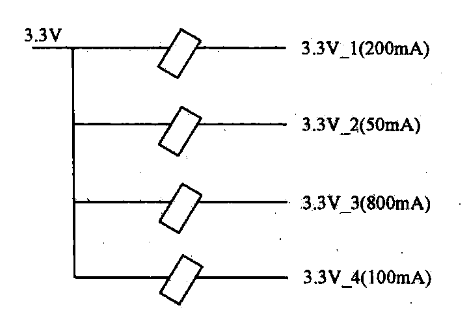
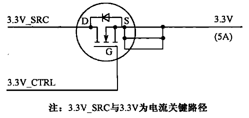
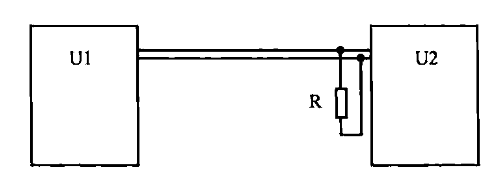
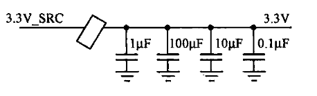

## 一、硬件设计流程

硬件设计的流程分为以下几个步骤:

| 步骤                                    | 目的                                                                                                                                                  |
| :------------------------------------ | :-------------------------------------------------------------------------------------------------------------------------------------------------- |
| [需求分析](03-硬件设计生命周期与标准闭环流程.md#^959030) | 需求分析阶段的工作是制定设计的大方向，不能忽略细节，但也不能拘泥于细节。需求分析阶段的工作并不是哪一个特定工程师的工作，而应由项目经理、系统工程师、电子设计工程师、软件工程师、逻辑工程师等协作完成。                                                 |
| [概要设计](03-硬件设计生命周期与标准闭环流程.md#^df6b0a) | 硬件概要设计的主要任务是设计系统框图、关键链路连接图、时钟分配框图等，并制定电源设计总体方案，对信号完整性及EMC的可行性、结构与散热的可行性、测试可行性等环节，做初步的分析。在这一阶段，需要电子设计工程师、电源工程师、信号完整性工程师、结构与热设计工程师、EMC工程师、测试工程师等协同工作。 |
| [详细设计](03-硬件设计生命周期与标准闭环流程.md#^eebbae) |                                                                                                                                                     |
| [调试](03-硬件设计生命周期与标准闭环流程.md#^895736)   |                                                                                                                                                     |
| [测试](03-硬件设计生命周期与标准闭环流程.md#^5bff8a)   |                                                                                                                                                     |
### 1、需求分析

需求的种类很多，与硬件开发相关的有以下几类，以以太网产品的需求分析为例，进行简单介绍。
#### 1）整体性能要求：

如数据包转发能力、处理延时、最高处理带宽、CPU处理能力等。针对这些需求，对，可初步对CPU、存储器、交换芯片等器件进行选型。
#### 2）功能要求：

如 QoS(Quality of Service，服务质量)、各类以太网相关协议的实现等。针对功能要求，可对多个厂家提供的交换芯片等器件做进一步细分，筛选能满足所有功能要求的器件。
#### 3）成本要求：

成本分析是需求分析中重要的一步，在满足客户需求的前提下，尽可能地降低成本，是硬件工程师的重要职责。在成本的分析中，应计算各套方案下单板的总成本，在某些场合，还需计算单个用户接口的成本。例如，某客户提出的需求是1000个以太网接口，针对该需求，提出了两套方案，分别是单块业务板提供24和48个接口，相对前者，后者对CPU和存储器的要求比较高，在这种情况下，计算单个接口的成本比计算整个单板的成本更有意义。
#### 4）用户接口需求：

- 如接口的种类、数目，指示灯及其规范、复位键、电源按钮等。同时，该类需求还包括与用户操作相关的要求，如对单板状态的在线监控等。这类要求多着眼于细节，不大会影响关键器件的选型，但若忽略了其中的某一项，即可能导致整个产品的失败。例如，某产品的用户面板上提供有主、备两个串口，分别标识为“Master”和“Slave”，由于“Slave”在英文中有奴隶的含义，违反了某些地区对电子产品标识的规定，导致该产品在这些地区无法销售。
#### 5）功耗要求:

功耗要求是单板上电源功率分配的依据，涉及电源架构的设计、电源电路器件的选型。
### 2、概要设计

- 硬件概要设计的主要任务是设计系统框图、关键链路连接图、时钟分配框图等，并制定电源设计总体方案，对信号完整性及EMC的可行性、结构与散热的可行性、测试可行性等环节，做初步的分析。在这一阶段，需要电子设计工程师、电源工程师、信号完整性工程师、结构与热设计工程师、EMC工程师、测试工程师等协同工作。
- 需求分析的目标是选定一套最佳的方案，确定关键器件及总体架构，而概要设计则是对该架构做进一步的细化，在概要设计阶段，与硬件设计相关的各部门工程师开始介入并做可行性分析，若发现总体方案的某些方面不可行，应回馈给项目经理，重新进行需求分析，并更改方案。因此，可以认为，需求分析和概要设计这两个阶段是螺旋形前进并不断反复的过程。

### 3、详细设计

概要设计完成后，单板的总体框架已经确定，则在详细设计阶段需要完成的工作是，基于该框架，将每一个部分细化。以下简要地介绍各职能部门工程师的职责。
### 4、调试

单板从工厂生产加工完成后，回到研发部门，由电子设计工程师、逻辑设计工程师、电源设计工程师、软件工程师协同进行调试。
1. 对第一次回到研发部门的单板，首先需要做的是验证是否存在电源短路现象。例如，某块单板有以下几种电源：`3.3V`、`2.5V`、`1.8V`、`1.2V`，则调试阶段的第一个步骤就是验证这些电源是否与`GND`(单板上的信号地)发生了短路，以及各电源之间是否发生短路。对电源保护设计不完善的单板，这一步骤尤为重要。
2. 第二个步骤是对单板上可编程器件程序的加载。
3. 其后，对电源电路、逻辑设计、时钟和复位电路等功能模块的调试可并行进行。
当以上功能模块的调试通过后，可开始测试流量。流量测试是验证单板上各部分电路协调工作的最佳工具，在这一步，除长时间正常流量的测试外，还需人为地模拟一些可触发中断等告警功能的流量，以对相应功能模块进行验证。
### 5、测试

- 测试是对设计进行验证的重要阶段。硬件测试工程师是这一阶段的主要负责人，其关键输入为详细设计阶段后期电子设计工程师拟定的测试计划。

#### 1）测试主要内容

1. 测试设备列表。列出测试中所需仪器的型号和数目，如电源、示波器、探头、万用表、信号发生器等。
2. 测试环境的搭建图。绘制测试仪器与被测单板的连接示意图，若测试中需要以太网口、串口等线缆的连接，示意图中还需标明线缆的规格、线缆连接的方式及对应端口的地址。
3. 电源测试。测试各电源的电压及电流(针对空载和满载两种情况)、纹波、噪声、上电顺序、下电顺序。
4. 各接口信号的信号完整性与时序。在测试计划中，应列出待测信号的网络名、时序要求等。
5. 各通用接口的功能测试。通用接口指12C、RS-232等标准接口，在测试计划中应列出各接口的访问地址及测试代码。
6. 复位链路的测试。
7. 晶振、时钟驱动器、锁相环等与时钟相关的测试。测试时钟信号的频率、上升/下降边沿时间，对关键时钟信号，还应借助温箱，测试环境温度变化时时钟频率的稳定度。需注意，不推荐利用示波器测试时钟频率，而应采用专门的频率测试仪进行测试。
8. 指示灯、单板在位信号、槽位号等杂项的测试。
9. 流量的测试。测试计划中应列出流量测试的数据流向图，测试代码、测试时间，误码率要求等。
#### 2）其他测试

除以上常规测试外，在测试计划中还需包括某些强度测试的测试项。不同类型的单板有不同的强度测试项，以下仅举一些通用的例子。
1. 电源监控功能的测试。例如，通过强制将电源电压调整超出监控的阈值，判断监控电路是否报警。
2. 极限环境的测试。例如，调整板上电源输出电压到最高、最低极限值，调整温箱的温度变化率，在这些极限环境下对流量进行测试。
3. 若单板上包括有某些特定用户接口，如以太网电口、光口，光传输的`E1`、`T1`等端口，都需要根据接口所对应的标准规范，验证接口是否满足规范的要求。
4. 在测试阶段，硬件测试工程师的职责是按照测试计划书一项一项地测试，并将结果反馈给电子设计工程师，针对测试所发现的问题，提供相应的更改意见。

## 二、[原理图设计](../../资料/高速电路设计实践%20(王剑宇,%20苏颖)%20(Z-Library).pdf#page=23)

原理图是电路设计的中间文件，虽然其并不直接用于指导生产，但却是连接设计理念和最终产品的关键纽带。电子设计工程师是原理图的责任人，多数设计者认为原理图不过是生成网表的源文件，至于其设计风格则完全可以依个人喜好而定。事实上，原理图在整个设计过程中，起着非常关键的作用。
1. 首先，原理图是设计思想的体现，混乱的原理图只能代表混乱的设计思想。
2. 第二，原理图是电子设计工程师与PCB设计工程师沟通的重要工具，当单板复杂到一定程度时，电子设计工程师不可能通过语言将所有PCB设计时需注意的细节都告知PCB设计工程师，例如，PCB 设计工程师从原理图获得网络连接关系表(简称网表)，虽然知道各器件的连接关系，但却无法获得器件摆放位置等信息，在这种情况下，原理图的标注将成为重要的工具，一方面使PCB 设计工程师对设计的要求一目了然，另一方面也能对电子设计工程师起到提醒作用，避免在设计、测试时遗忘某些关键细节。
3. 第三，脉络清晰的原理图有助于提高调试、测试、生产等环节的效率。由以上看来，原理图并不只是一份中间文件，为了得到一份优质的原理图，在设计的过程中，有许多事项需要注意。
### 注意事项

1. **在原理图的首页，应绘制单板的总体框架图**。若单板较复杂，还应根据需要，在后续页上绘制电源架构框图、时钟拓扑图、复位链路拓扑图、中断链路拓扑图、边界扫描链路图等。若单板的面板接口较多，建议增加一页用于面板图示。若`I2C`总线的拓扑较复杂，还需增加一页用于注释各`I2C`器件的地址。
2. 在原理图上电源电路的输出端附近，应标注该路电源的电压值和电流值。例如，下图中，由磁珠从`3.3V`分出四路`3.3V`的支路，各支路电流不同，在原理图上标注电流后，有助于PCB工程师把握在哪些支路应做加粗走线、增加电源过孔等处理。需说明的是，下图中括号包含的部分（如`200mA`）只是注释，不属于网络名称的一部分。
	
3. 标注关键电流通路。例如，在下图中，`MOSFET `的源极和漏极两端的路径属于关键电流通路，在原理图上标注后，有利于PCB设计者对该路径引起重视，做加粗走线等处理。
	
4. 绘制原理图时要兼顾在PCB设计中对器件布放位置的要求。在第8章将介绍阻抗匹配，阻抗匹配电路对器件的布放位置有一定的要求，例如，始端匹配电阻应靠近发送端器件放置，终端匹配电路应靠近接收端器件放置，在原理图的绘制中应体现这一原则。例如，`U1`和`U2`分别为发送、接收器件，`R`为终端匹配电阻，在PCB上应靠近`U2`放置，则推荐按下图方式绘制原理图。有时，`U1`和`U2`位于原理图上不同的页，则推荐将`R`放置在`U2`的那一页上。
	
5. 按照PCB上电容的排列顺序绘制原理图的电容滤波电路。某`3.3V`滤波电路要求，在PCB上，`1uF`电容应放置在最外边，随后是`100uF`、`10uF`、`0.1uF`，则对应的原理图部分应绘制如下图所示。
	
6. 原理图上应标注关键信号的速率、走线层，若信号线之间有走线长度关系，也建议标注在原理图上。
7. 原理图上应标明高散热及热敏感器件，若有特殊的放置要求，也可在原理图上加以注释。
8. 对关键器件，在原理图上应标明其对应的料号、精度、尺寸等信息。这些关键器件包括保险管、分压电路中的电阻，电源滤波电路中的电感、磁珠、电容，电源电路中的电压及开关频率调节电阻、`MOSFET`、二极管、电压采样电阻等。
9. 在原理图上，应对跳线、选焊器件的配置方法等进行注释。
10. 在原理图上，应标注与背板连接的连接器、面板上`LED`指示灯的排列顺序。
