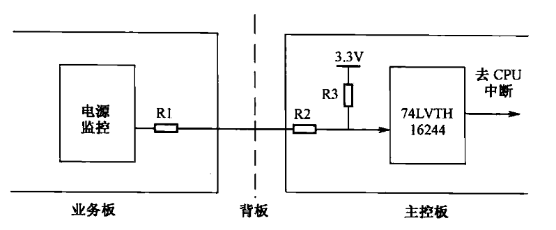
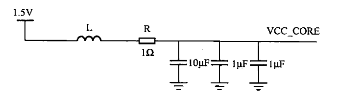
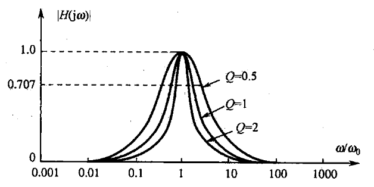

## 一、相关案例
### 案例一：串联电阻过大，导致板间告警失败
某产品由业务板和主控板构成。业务板上电源监控芯片的告警信号通过背板，输送到主控板，经主控板上逻辑芯片`74LVTH16244`处理后连接到主控板上`CPU`的中断信号。功能测试发现，强制将业务板被监控的一路电源拉地，`CPU`中断信号却不被使能。
#### 讨论

考虑到单板的热插拔要求，信号和背板连接器之间都串有电阻。$R=1k\Omega$，$R2=100\Omega$ ，$R3=1k\Omega$。进行强度测试时强制将被监控的电源接地，在业务板侧，测量业务板电源监控芯片输出的告警信号，可测得有效低电平$(0V)$，但在主控板`74LVTH16244`侧，测得输入信号电平为$1.7V$，远超出低电平的输入门限。
`74LVTH16244`是高阻抗输入，因此$3.3V$将在三个电阻上分压。当电源监控芯片输出低电平$0V$时，经过分压后，在主控板上`74LVTH16244`的输入端分得电平为$\frac{3.3V}{2.1k\Omega}\times1.1k\Omega=1.7V$，超出低电平门。将$R1$的阻值更换为$33\Omega$，告警时`74LVTH16244`输入电平为为$\frac{3.3V}{1.133k\Omega}\times 0.133k\Omega=0.38V$仍在低电平门限之内，主控板能正确识别告警信息。
需要提及的是，有些设计者会有疑问，将$R1$的阻值改为$33\Omega$后，`74LVTH16244`输入电平$0.38V$虽然处在输入信号的低电平门限范围内，但裕量不是很大，能不能将$R3$的阻值增大，如采用$4.7k\Omega$等，使得告警时`74LVTH16244`输入电平进一步降低?
**答案是不能，这涉及逻辑器件实现电平翻转时的电流要求**。
### 案例二：电阻额定功率不够造成的单板潜在缺陷
某单板上`PHY`芯片(以太网物理层芯片)的核心电源滤波电路设计如下图所示。

根据`PHY`芯片资料，该电源对噪声等干扰特别敏感，因此在设计中不仅采用了$LC$滤波电路，还在电感$L$之后串联了一个$1\Omega$的电阻$R$。$LC$滤波电路能滤除高频段噪声，而本电路中的电阻$R$不仅能衰减高频段噪声，而且能衰减低频段噪声，即能作为一个全频段衰减器。这种设计方法常用于对噪声特别敏感的电源，如时钟的电源等。**单板长时间运行发现，电阻$R$经常爆裂。**
#### 讨论
设计中选用的电阻$R$，尺寸为$0402$，额定功率为$1/16W$，核对`PHY`芯片资料，其内核电源最大功耗为$300mW$，即最大电流为$200mA$，而该电阻的最大通流能力仅$62.5mA$。当`PHY`全速工作时，电流将超过电阻的额定电流，造成电阻失效。类似的案例很多，设计者在电阻选型时，对**阻值**往往非常关注，却比较容易忽略对**额定功率**的审核。
***若电阻的额定电流和实际工作电流比较接近，则可能构成产品的一个潜在缺陷。***
#### 拓展
在本案例中，电阻起的是全频段滤波的作用，在类似应用中，电阻还有一个作用是降低电路的品质因数$Q$。
$Q$定义为回路发生谐振时，储存能量与一周期内消耗能量之比。在一个由$R$、$L$、$C$组成的串联电路中，总阻抗
$$
Z=R+1/(j\omega C)+j\omega L=R+j[\omega L-1/(\omega C)]\tag{1}
$$
回路谐振时，假定谐振频率为$\omega_0$，则满足$\omega_0 L=1/(\omega_0 C)$，此时电路的总阻抗达到最小值$R$，$Q$的值如下:
$$
Q= \omega_0 L/R = 1/(\omega_0 CR) = \frac{1}{R\times \sqrt{\frac{L}{C}}} \tag{2}
$$
因此，回路发生谐振时，能量将集中于谐振频率点$\omega_0$。根据$Q$值的不同，绘制回路幅频特性曲线如下图所示，图中$|H(j\omega)|$是电路传递函数的模，该值越接近$1$，表示电路越能无损耗地传递能量。从图中可以发现，$Q$值越大，能量越集中，表现为$|H(j\omega)|$的值越接近$1$，电路的损耗越小。

**在储能电路中，$Q$值越大，意味着损耗越小;在选频电路中，$Q$值越大，意味着滤除其他频带信号的能力越强。因此在这些情况下，希望$Q$值越大越好。**
**但在电源或信号线路中，$Q$值越大，通频带内特性曲线越陡峭，越容易引发振铃等现象，信号通过这种回路后容易发生失真**。因此在这种情况下，希望$Q$值小一些比较好。在本例所示的原理图中，加入电阻R可降低$Q$值，以避免电源线路的振荡。
### 案例三：电阻在时序设计中的妙用
某设计要求`FPGA`芯片兼容地支持两个厂家的存储器，经时序分析发现，这两个厂家的存储器虽然引脚的定义完全相同，但时序参数却略有差异。经时序计算后，`B`厂家存储器件的时钟信号线要比`A`厂家的长$600mil$(mil即米尔，是长度单位，$1mil=0.0254mm$)。
#### 讨论
**一个设计（即同一份原理图和 `PCB`）同时兼容两个厂家的器件，是电路设计中常见的需求，此时，$0\Omega$电阻往往能起到极好的作用。**
如下图所示，当采用`A`厂家存储器时，将$R1$加入物料清单中，而$R2$和$R3$不入物料清单;当采用`B`厂家存储器时，$R2$和$R3$加入物料清单，而$R1$不入物料清单。

#### 设计注意事项
`PCB`设计的注意事项有:
1. 第一：$R2$需紧紧靠近$R1$的左边引脚放置，$R3$需紧紧靠近$R1$的右边引脚放置，这样做的目的是减少在时钟信号线上可能出现的分叉($stub$);
2. 第二：**$R2$和$R3$之间的走线长度为$600mil$**，以满足`B`厂家存储器的时序要求。
如果信号速率极高，短小的分叉将对信号完整性产生很大的影响，因此，当设计不允许信号线上存在分叉时，可以采用如下图所示的`PCB`设计。

在上图中的`PCB`上，将$R2$和$R3$各自的一个引脚焊盘与$R1$的两个引脚焊盘分别重合，$R2$和$R3$的另一个引脚通过$600mil$走线连接，从而可以完全避免在$R1$与$R2$、$R3$之间存在的分叉。采用这种方式，`PCB`上将出现设计规则检查(`DRC`)错误，可以将这个错误忽略，并通知产品工程师。