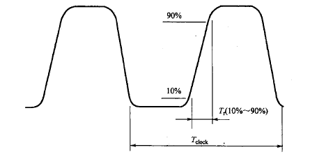

## 一、高速信号的界定

1. 高速信号不是按照信号周期$F_{clock}$来界定的，而是通过转折频率$F_{knee}$
2. 转折频率（$F_{knee}$​，也称有效频率）是**高速数字电路设计中界定信号关键高频分量的核心阈值**，它并非信号 “最高频率”，而是决定信号频谱能量分布特征的**分界点**，直接决定了电路是否需要按 “高速设计” 标准处理。计算为:

$$F_{clock} = 1/T_{clock}\tag{1}$$

$$F_{\text{knee}} = \frac{0.5}{T_{r(10\,\%\sim 90\,\%)}} \tag{2}$$

### 1. 理想方波的频谱规律

图里先给了基础：**任何信号都是正弦波叠加而成**。

- 周期频率为F的理想方波，由「基波$F$ + 奇次谐波$3F、5F、7F$」组成
- 各次谐波的幅值公式：

$$VN​=\frac{2}{\pi\times N}≈\frac{0.64}{N}​(\pi≈3.14)\tag{2}$$
- 1 次谐波（基波）：$V1​=0.64V$
- 3 次谐波：$V3​=0.21V$
- 5 次谐波：$V5​=0.13V$
    
	
    
- 核心规律：**理想方波的谐波幅值，和频率成反比（-20dB/dec 衰减）**，高频分量一直存在，只是越来越小。

### 2. 现实信号的频谱：转折频率的定义

现实中的信号不是理想方波，它有**上升 / 下降时间**，所以高频分量会衰减得更快：

- 低频段：和理想方波一样，幅值随频率 - 20dB/dec 衰减
- 高频段：衰减速度变成 - 40dB/dec（比理想方波快一倍）
- 图里给了**转折频率的精确定义**：
    
	> 当某一级谐波的幅值，下降到「理想方波同频率分量幅值的 70%」（也就是功率下降到 50%，-3dB 点），这个频率就是**有效频率（转折频率）**
- 对于0.5系数计算比较复杂表现为$-20dB/dec$与$-40dB/dec$的交点

####  实际数字信号的模型：梯形波

理想方波是上升时间为 0 的极限情况，实际信号是**梯形波**，其周期为 T，上升 / 下降时间为 Tr​，脉宽为 τ。

梯形波的傅里叶级数展开（频谱）为：

$$V_n​=\frac{2Aτ}{T}​⋅sinc(\frac{nπτ}{T}​)⋅sinc(\frac{nπT_r}{T}​​)\tag{4}$$

其中：
- A 是信号幅值，n 是谐波次数（n=1,3,5...）
- $sinc(x)=sin(x)/x$，是频谱的包络函数

####  频谱包络的两个衰减段

- **低频段（$f≪<<1/T_r​$）**：$sinc(\frac{nπT_r}{T}​​)≈1$，频谱包络为 $sinc(\frac{nπτ}{T}​​)$，幅值随频率 **-20dB/dec** 衰减（和理想方波一致）。
- **高频段（$f>>1/T_r​$）**：$sinc(\frac{nπT_r}{T}​​)≈\frac{T}{n\pi T_r}$，频谱包络以 $1/f^2$ 衰减，对应 **-40dB/dec**（比理想方波快一倍）。

#### 两个衰减段的转折点：-3dB 点

两个频段的交界点，就是频谱包络从 - 20dB/dec 变为 - 40dB/dec 的位置，也就是**幅值降到理想方波的 70%（-3dB）的位置**。

对于**10%~90% 上升时间**的梯形波，经过严格的傅里叶变换计算，这个转折点的频率满足：

$$F_{knee}​=\frac{0.5}{T_{r(10\%∼90\%)}}\tag{5}​​$$
^95cb6a

- 系数 0.5 的本质：是 $10\% \sim 90\%$ 上升时间下，梯形波频谱 $- 3dB$ 截止点的**精确数学解**，不是经验值。
- 若采用 $20\% \sim 80\%$ 上升时间，对应系数为 $0.35$，本质是不同上升时间定义下的 $- 3dB$ 点位置不同。

## 二、有效频率定义

1. 信号幅值衰减$\frac{1}{\sqrt{2}}$倍
2. 上升时间$T_r$倒数的一半
3. 功率衰减$0.5$倍

