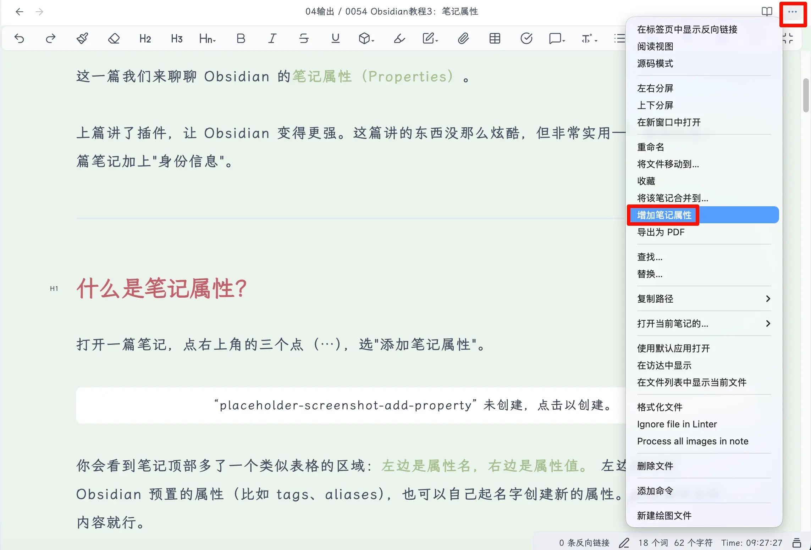
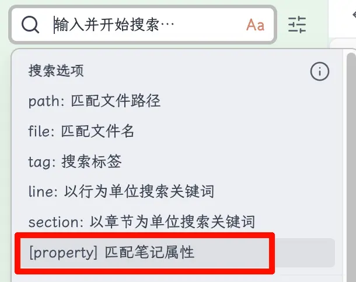
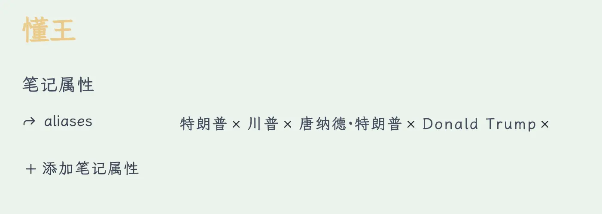

这一篇我们来聊聊 Obsidian 的 **笔记属性（Properties）** 。

上篇讲了插件，让 Obsidian 变得更强。这篇讲的东西没那么炫酷，但非常实用——给你的每一篇笔记加上"身份信息"。

---

## 什么是笔记属性？

打开一篇笔记，点右上角的三个点（⋯），选"添加笔记属性"。



你会看到笔记顶部多了一个类似表格的区域： **左边是属性名，右边是属性值。** 左边可以选 Obsidian 预置的属性（比如 tags、aliases），也可以自己起名字创建新的属性。右边填对应的内容就行。  就这么简单。不需要懂任何代码。

## 那个 YAML 是什么？

如果你切换到 **源码模式** （设置 → 编辑器 → 默认编辑模式 → 源码模式），你会看到笔记属性其实长这样：

```
1
2
3
4
5
6
7
复制---

title: 我的笔记标题

date: 2026-03-03

tags:

  - Obsidian

  - 教程

---

复制
```

两组 `---` 之间的内容叫 **YAML frontmatter** ，是一种数据格式。但你 **完全不需要手动写这个** ——Obsidian 的可视化编辑器帮你搞定了一切。属性面板里点点选选，底层自动生成对应的代码。

知道有这么个东西就行，日常使用不需要碰源码。

---

## 笔记属性有什么用？

你可能会问：我直接在正文里写不就完了，为什么还要多加一层属性？

三个好处。

## 1\. 搜索更精准

普通搜索是全文搜索——你搜"教程"，所有正文里出现"教程"两个字的笔记都会跳出来，结果可能一大堆。

但如果你在属性里设了 `categories: 教程` ，就可以用 Obsidian 的搜索语法精准筛选：

```
[categories: 教程]
```



这样只会返回分类标注为"教程"的笔记，不会把正文里随口提到"教程"两个字的笔记也捞出来。

**属性是结构化数据，正文是非结构化数据。** 当你的笔记量上到几百篇之后，这个区别会越来越明显。

## 2\. 模板自动填充

这个是和 **模板** 配合使用的。下一篇我们会详细讲模板，这里先剧透一下：

你可以在模板里预设好属性，比如 `date: {{date}}` 。每次用这个模板新建笔记，日期会自动填上当天的时间，不用手动写。标题、分类这些重复性的属性也一样，模板帮你自动填好。

## 3\. 剪藏和导入自动带上

如果你用浏览器剪藏插件（比如 Obsidian Web Clipper）把网上的文章保存到 Obsidian，剪藏下来的笔记会自动带上属性——原文标题、链接、保存日期这些信息都在属性里，帮你记清楚这篇东西从哪来的。

---

## 常用的笔记属性

属性可以自己随便创建，但有几个是最常用的，建议了解一下。

## 1\. title（标题）

顾名思义，就是笔记的标题。

**注意：title 属性和文件名可以不一样。** 文件名是你在文件列表里看到的那个名字，title 属性是笔记的"官方标题"。

比如我的文件名叫 `0054 Obsidian教程3：笔记属性.md` ，但 title 属性写的是 `Obsidian教程3：笔记属性` ——前面的编号是给文件排序用的，不需要出现在标题里。

**我个人的建议：** 如果你没有特殊的编号需求，title 和文件名设成一样的就好，省得自己都搞混。

## 2\. date（日期）

记录笔记的创建日期或发布日期。

手动填写的话，格式是 `YYYY-MM-DD` ，比如 `2026-03-03` 。

**但这里有个技巧：** 如果你是在模板里设置 date 属性，建议写成：

```
1
复制date: "{{date}}"

复制
```

这样每次用模板新建笔记时， `{{date}}` 会自动替换成你创建这篇笔记的日期。不用自己手动输入，也不会写错。

这个功能在下一篇讲模板的时候会详细介绍。

## 3\. aliases（别名）

**这个属性非常有用，一定要了解。**

aliases 的作用是给一篇笔记取多个名字。 **同一个东西，我们经常会用不同的叫法** ，这时候 aliases 就派上用场了。

举个例子。我的笔记库里有一篇关于特朗普的笔记，文件名叫"懂王"。但是我在其他笔记里写到这个人的时候，可能会写"川普"、“特朗普”、“唐纳德·特朗普"甚至"Donald Trump”。

如果没有 aliases，你用 `[[川普]]` 创建双链，Obsidian 会认为你要链接一篇叫"川普"的笔记。但这篇笔记不存在——你的笔记叫"懂王"。结果就是：明明说的是同一个人，双链却指向不同的地方。

**设置了 aliases 之后就不一样了。** 我在"懂王"这篇笔记的属性里这样写：

```
1
2
3
4
5
复制aliases:

  - 特朗普

  - 川普

  - 唐纳德·特朗普

  - Donald Trump

复制
```



现在不管你在任何笔记里输入 `[[`，然后打"川普"、“特朗普"或者"Donald Trump”，Obsidian 都会提示你链接到"懂王"这篇笔记。 **多个名字，一个入口。**

这在建立知识库的时候特别好用。很多概念都有别称、缩写、英文名，用 aliases 统一管理，双链就不会乱。

## 4\. categories（分类）

给笔记标记一个大类，比如"读书笔记"、“教程”、“随想"等。

```
1
2
复制categories:

  - Obsidian教程

复制
```

分类主要是给自己看的，帮你快速筛选同一类文章。如果你以后想把笔记发到博客上，很多博客系统（比如 Hugo、Hexo）也会直接读取这个属性来生成分类页面。

## 5\. tags（标签）

标签大家应该不陌生。在 Obsidian 里，你可以在正文中用 `#标签名` 的方式打标签，也可以统一写在属性里：

```
1
2
3
4
复制tags:

  - Obsidian

  - 教程

  - 笔记工具

复制
```

写在属性里的好处是 **集中管理** ——一眼就能看到这篇笔记有哪些标签，不用在正文里到处翻。

**不过说句实话** ，在 Obsidian 里，标签的作用很大程度上可以被 **双链** 替代。你觉得某个概念重要到需要标签？不如直接给它建一篇笔记，然后用双链引用。双链比标签更灵活，能承载更多内容。

当然，如果你习惯了用标签，完全没问题。标签和双链不冲突，选你顺手的方式就好。

## 6\. 其他有用的属性

除了上面五个，还有几个你可能用得上：

**cssclasses** — 给单篇笔记指定特殊的 CSS 样式。比如你想让某篇笔记用不同的字体或布局，可以通过这个属性配合自定义 CSS 实现。进阶玩法，新手先跳过。

**publish** — 如果你用 Obsidian 的官方发布服务（Obsidian Publish），这个属性控制这篇笔记是否对外发布。 `true` 发布， `false` 不发布。

**description** — 笔记的简要描述或摘要。搭配博客系统使用时，这个属性通常会显示在文章列表里作为预览文字。

你还可以创建任何自己需要的属性——比如 `author` （作者）、 `source` （来源）、 `status` （状态：草稿/已完成）等。属性是完全自定义的，你觉得有用就加。

---

## 总结

**今天学到了什么：**

1. **笔记属性是什么** ：笔记顶部的结构化信息，点三个点就能添加，不需要写代码
2. **为什么要用** ：精准搜索、模板自动填充、剪藏自动带信息
3. **常用属性** ：
	- title（标题）— 可以和文件名不同
		- date（日期）— 模板里写 `{{date}}` 自动填充
		- aliases（别名）— 多个名字指向同一篇笔记，双链必备
		- categories（分类）— 给笔记归大类
		- tags（标签）— 集中管理，但双链可以替代大部分场景
4. **属性完全自定义** ：需要什么就加什么

**核心要点：**

- **aliases 是最值得用的属性，双链体系的好搭档**
- **标签能用，但在 Obsidian 里双链更香**
- **属性不用一开始就设很多，用到再加**

---

## 下期预告

下一篇我们介绍 Obsidian 的 **模板功能** ——怎么创建一个模板，怎么快速调用模板来新建笔记，让你的笔记属性、格式一键搞定。

如果觉得有帮助，记得关注这个系列！