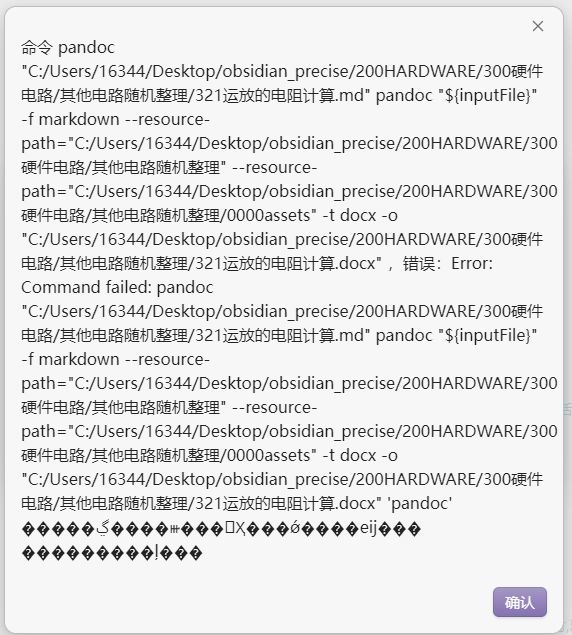
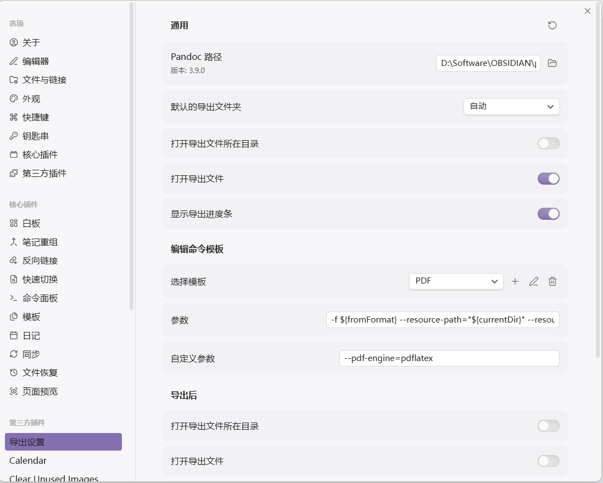

## 问题一，导出时附件路径有问题

显示找不到附件路径。对于这个问题常常出现在导入的文档命名时并没有重新命名刷一下，此时附件命名不是配置的那种，就会出现找不到文件路径
**消除办法为，给笔记重新命名然后再改回去，此时附件名字就会你被重新刷新然后命名就对了，就可以导出了**

## 注意

1. 对于`pandoc`的使用，本笔记的所有导出都采用`Enhancing Export` 插件，但是对于这个插件需要有`pandoc.exe` 对于此需要单独下载安装然后配置才能使用

## Pandoc建议添加到系统路径

1. 复制pandoc可执行文件路径

	
2. 打开编辑系统环境
	
3. 添加到系统路径，通过`pandoc -v`验证

	
	