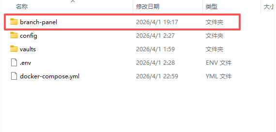
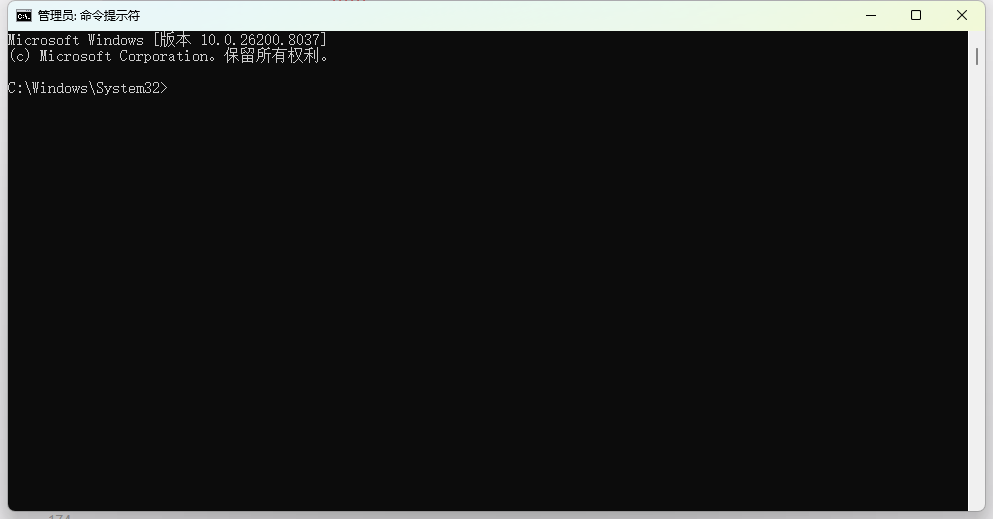
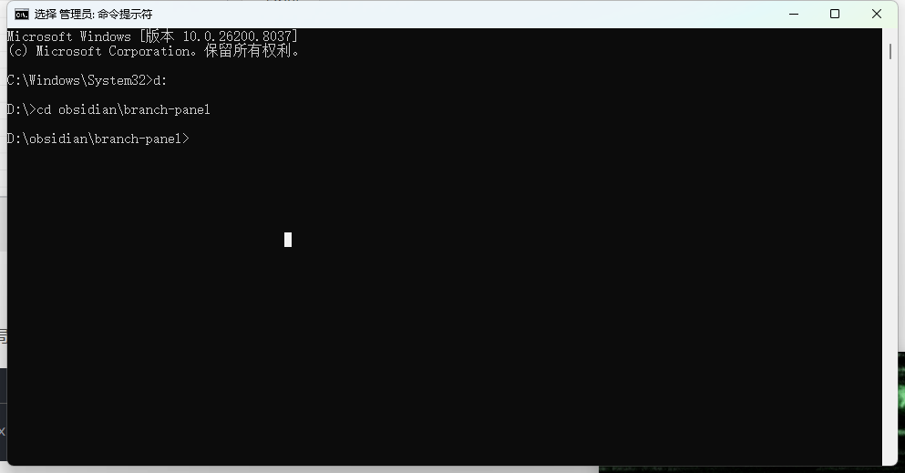
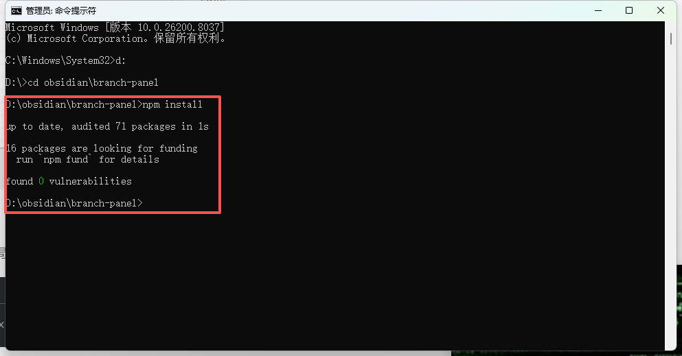
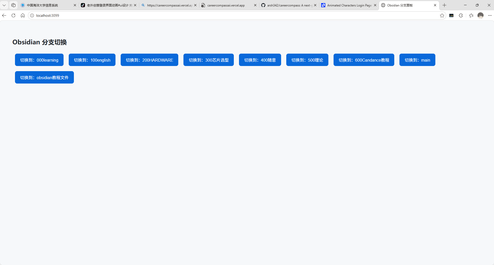
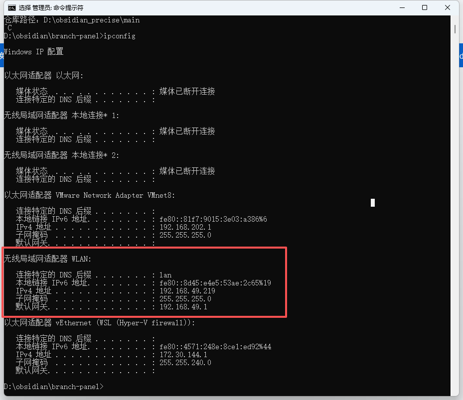

## 极简Node版 | 无需修改Docker | 网页可视化操作

### 适用场景

Docker挂载本地Git笔记仓库、多分支分类管理笔记，放弃CMD手动输Git命令，浏览器一键切换分支，切换后直接同步至Docker内Obsidian，全程图形化操作。

---

## 一、前置准备

1. 安装**Node.js LTS稳定版**（后端运行环境）

下载地址：[https://nodejs.org/](https://nodejs.org/)

【配图1：Node.js官网LTS版本下载区域截图】

2. 确认本地Git仓库路径：`D:\obsidian_precise\main`（核心笔记目录，不可错）

3. 手动新建文件夹：`D:\obsidian\branch-panel`（存放后台代码）



---

## 二、第一步：安装Node.js并验证

[4、Node.js 下载安装与环境配置全流程（保姆级详解） 图文详解，快速上手](4、Node.js%20下载安装与环境配置全流程（保姆级详解）%20图文详解，快速上手.md)

---

## 三、第二步：创建核心代码文件

进入文件夹 `D:\obsidian\branch-panel`，新建**两个纯文本文件**，修改文件名+后缀：

### 文件1：package.json（依赖配置文件）

粘贴以下完整代码：

```JSON

{
  "name": "obsidian-branch-panel",
  "dependencies": {
    "express": "^4.18.2",
    "cors": "^2.8.5"
  }
}
```

### 文件2：server.js（后端核心+网页控制面板）

粘贴以下完整代码：

```JavaScript

const express = require('express');
const cors = require('cors');
const { execSync } = require('child_process');
const fs = require('fs');

const app = express();
app.use(cors());
app.use(express.urlencoded({extended:true}));

// 固定你的本地Git笔记目录
const GIT_DIR = "D:/obsidian_precise";

// 获取所有Git分支接口
app.get('/api/branches', (req,res)=>{
  try{
    const out = execSync(`cd "${GIT_DIR}" && git branch`, {encoding:'utf8'});
    const branches = out.split('\n').filter(x=>x).map(x=>x.replace('* ','').trim());
    res.json({branches});
  }catch(e){
    res.json({error:e.message});
  }
});

// 一键切换分支接口（自动拉取最新代码+切换）
app.post('/api/switch', (req,res)=>{
  const branch = req.body.branch;
  try{
    execSync(`cd "${GIT_DIR}" && git pull && git switch ${branch}`, {encoding:'utf8'});
    res.json({ok:true,msg:`✅ 已成功切换到分支：${branch}`});
  }catch(e){
    res.json({ok:false,error:`❌ 切换失败：${e.message}`});
  }
});

// 前端可视化网页面板
app.get('/', (req,res)=>{
  const html = `
<!DOCTYPE html>
<html>
<head>
<meta charset="utf-8">
<title>Obsidian 分支控制面板</title>
<style>
body{padding:30px;font-size:18px;font-family:微软雅黑;}
button{margin:10px;padding:12px 20px;font-size:16px;cursor:pointer;background:#2385bb;color:white;border:none;border-radius:6px;}
button:hover{background:#1a6b99;}
</style>
</head>
<body>
<h2>📂 Obsidian Git 一键分支切换</h2>
<div id="list"></div>
<script>
fetch('/api/branches').then(r=>r.json()).then(d=>{
  d.branches.forEach(b=>{
    let btn = document.createElement('button');
    btn.innerText = '切换到：'+b;
    btn.onclick=()=>{
      fetch('/api/switch',{
        method:'POST',
        body:new FormData().append('branch',b)
      }).then(r=>r.json()).then(res=>alert(res.msg||res.error))
    };
    document.getElementById('list').appendChild(btn);
  })
})
</script>
</body>
</html>
  `;
  res.send(html);
});

const PORT = 3099;
app.listen(PORT, ()=>{
  console.log(`🎉 分支面板已启动！访问地址：http://localhost:${PORT}`);
});
```


---

## 四、第三步：CMD完整操作（关键：解决盘符切换问题）

### 1. 打开系统CMD（命令提示符）



### 2. 必做：切换到D盘（核心易错点）

```Powershell
d:
```

执行后提示符从 `C:\` 变成 `D:\`


### 3. 进入项目文件夹

```Powershell
cd obsidian\branch-panel
```



### 4. 修复NPM权限（避免报错）
^[第一次打开可以不用]
```Powershell
npm config set cache "C:\Users\Public\npm-cache"
```

### 5. 安装项目依赖包

```Powershell
npm install
```

等待加载完成，无红色报错即为正常



### 6. 启动后台服务

```Plain Text
node server.js
```

控制台提示：`🎉 分支面板已启动！访问地址：http://localhost:3099` 就是成功


### 7. 关闭后台服务（重点）

在CMD窗口内，直接按下快捷键：`Ctrl + C`

弹出终止确认，回车即可关闭服务


---

## 五、网页端使用教程

1. 打开任意浏览器，输入地址：

```Plain Text
http://localhost:3099
```

1. 页面自动加载所有本地Git分支，显示对应按钮



1. 点击「切换到：xxx分支」按钮

2. 弹窗提示成功/失败，自动执行：拉取最新代码+切换分支

【配图12：切换分支成功的弹窗提示截图】

1. 刷新Docker内的Obsidian网页版，笔记立即同步为对应分支内容

---

## 六、核心适配说明（不改动原有架构）

1. Docker**零修改、零配置、无需安装Git**

2. 仅操作Windows本地Git仓库，文件夹挂载Docker实现实时同步

3. 不影响原有笔记、容器、数据存储

---

## 七、进阶功能

### 1. 局域网远程切换（手机/其他电脑可用）

1. 查看本机Windows内网IP（CMD输入 `ipconfig`）

【配图13：查看电脑内网IP的CMD截图】


1. 同局域网设备打开浏览器访问：

```Plain Text
http://你的内网IP:3099
```
```plain text
http://192.168.49.219:3099
```
### 2. 开机自动常驻后台（可定制）

如需设置电脑开机自动启动该服务，无需每次手动输命令，可后续补充配置教程。

---

## 八、常见问题排查

1. ❌ `cd`命令进不去文件夹：忘记先输入 `d:` 切换D盘

2. ❌ npm安装报错：重新执行「修复NPM权限」命令

3. ❌ 网页打不开：检查服务是否启动、3099端口是否被占用

4. ❌ 分支切换失败：本地笔记有未提交的修改，先归档/提交临时变更
